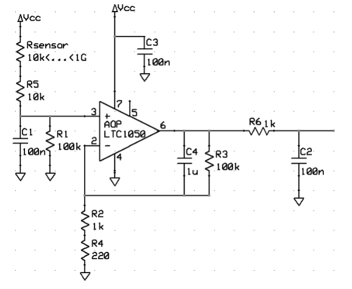
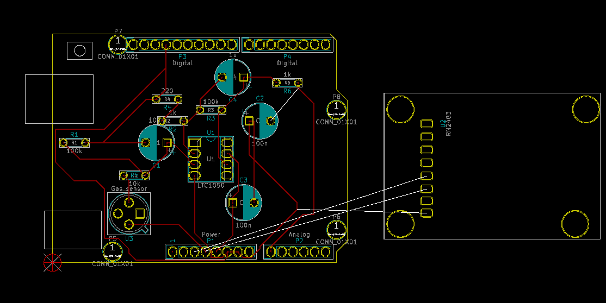
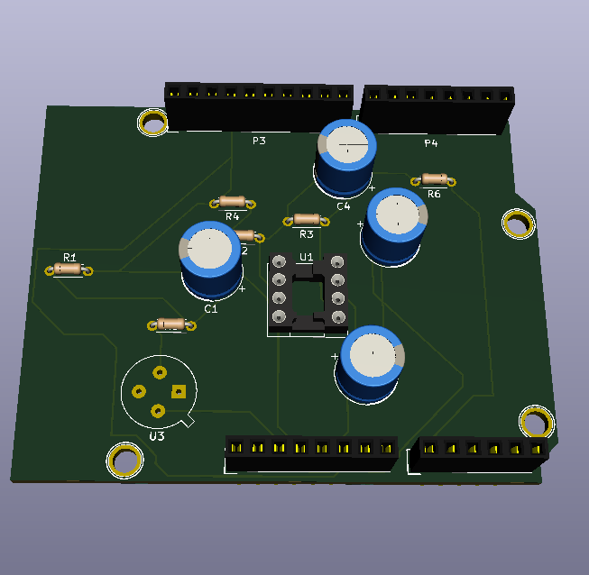

# Conzateidou_Laille_Gas-sensor
Julie CONZATEIDOU 5 ISS A1 - David LAILLE 5 ISS B1

<h1>Smart gas sensor - Data acquisition device</h1>

As part of the Innovative Smart System Master at INSA of Toulouse, we have to design a smart and connected gas sensor. Our project is divided into three parts. The first one consists in fabricating the gas sensor. That will be done during a session at AIME, in a few time. The second one is the communication part, which will be implemented by using LoRa modules. The last one is the realisation of a shield able to link the gas sensor and a microcontroller, an Arduino Uno card. That one will do the analysis en the transmission of data.
The design of the de data acquisition component has been realised with the software KiCad. It is composed of three main steps. First, we create, the schematic of the circuit that we want to fabricate. With that, we can simulate the behaviour of our circuit and check electrical connections.Then, we combine every component with the corresponding print. Finally, we make the routing of the card by drawing conductive track to link all the components on the same layer.
In the following parts, we will explain more precisely the organisation of the data acquisition device, and also the different steps to design it.

<h3>Functionalities</h3>
	
The circuit is composed of one instrumentation amplifier, made using AOP (LTC1050), one Arduino Uno card and one shield enabling the connection with LoRa module (RN2483).
	The instrumentation amplifier collect data from the gas sensor, amplify them to make them readable, and transmit them on analog pin A0. The pin A0 has been chosen randomly, so we could also use the other analog pins.
	The gas sensor is powered by 3.3V. The signal from the sensor is filtered with a RC circuit and then amplified (by around 100 in this case). The output of the AOP is also filtered with an other RC circuit. The power supply of the AOP (5V) can introduce some noise, so we add a capacitor to avoid the noise caused by this power supply.
	The circuit we have done is shown below.

  

<h3>Content</h3>

In this git, you will find :
<ul>
<li>the electrical schematic of the circuit<il>
<li>the netlist<il>
<li>the PCB with routing<il>  </ul>

<h3>Choices for design</h3>

We did not make the routing of the shield, in order to keep a device compact and not too large. Thereafter, we could weld the shield with the card.

<h3>Realization</h3>

Below, we can see the PCB with the routing. we represented the shield for LoRa on this picture to have an overview of the device, even if the module is not connected.

With 3D viewing, we can see what could be done in real.

<h3>Analysis</h3>

The major difficulty we encountered during the project was the design of the PCB. With the constraint of using only one layer, a lot of tracks were overlapping, and that made the routing harder. We had to work a lot on the layout of the components.
The conductive tracks are quite thin. Larger tracks could be more appropriate.

<h3>Possible improvements</h3>

The device is a simple data acquisition module. Afterwards in the project, we will add and program a LoRa module to be able to collect data from the gas sensor. These data could be sent, after, on a database like The Things Network to analyze and display them. With that improvement we could be able to follow the evolution of gas concentrations, remotely and in real-time. Another improvement could be the addition of a battery to make the device more autonomous, or by using solar plans.

